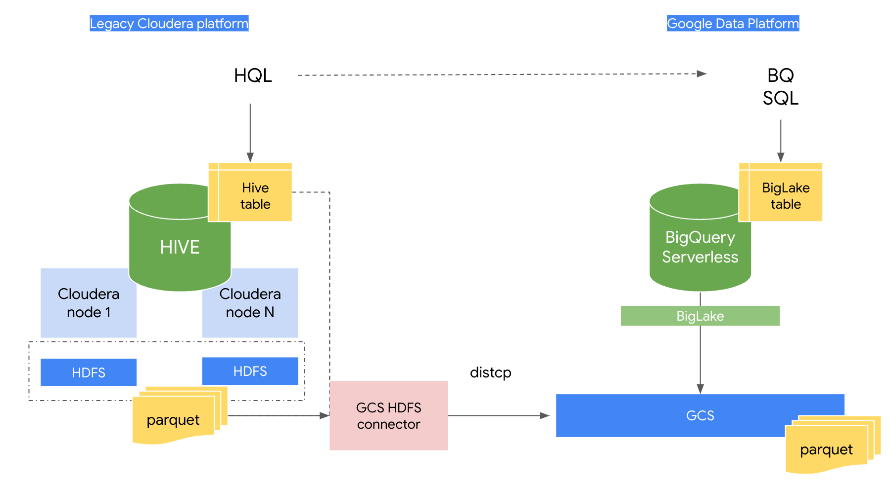

# Data Lake Golden demo plug-in 01: On prem Cloudera HIVE to BigQuery

NOTE: This is not a standalone repository, the content needs to be deployed on top of the
[Google Cloud Data Analytics Golden Demo](https://github.com/GoogleCloudPlatform/data-analytics-golden-demo)

## Introduction

This repository contains a step by step demo that shows to migrate a HIVE workload from a on-prem Hadoop deployment based on legacy Cloudera 5.7 distribution to a Google Cloud modern DataLake.
In detail the demo shows:

1. The use of the HDFS - GCS connector on a Cloudera deployment to easily move data from HDFS to GCS
2. How to migrate HIVE tables to Google Data Platform BigLake tables
3. How to migrate HQL queries to BigQuery SQL


## Architecture



## Installation

This repository contains a number of scripts that, on top, of the Golden Demo components bootstrap some others GCP components:

* A new subnet on vpc-main called `gce-subnet` 
* A Google Compute Engine VM `gce-cdh-5-single-node` with a Cloudera image that simulates a Cloudera (single-node) deployment
* A GCS bucket `hive_stage` 

```console
~$ git clone <THIS_REPOSITORY>
~$ cd dl01-hive-to-bq/src/terraform
~$ source local_project_launcher.sh <PROJECT_ID> <REGION> <ZONE>
~$ cd dl01-hive-to-bq/src/scripts-hydrated
~$ source upload_to_host.sh <ZONE>
# This will be executed from the Cloudera container
~$ cd /home/cloudera
~$ source ./prepare_node.sh

```


## Step by step demo


Work in progress

